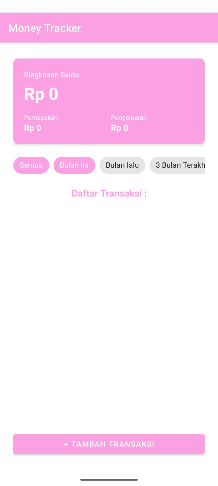
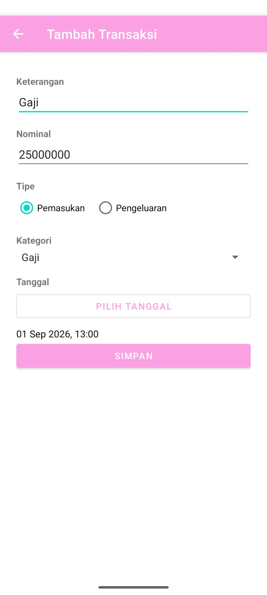
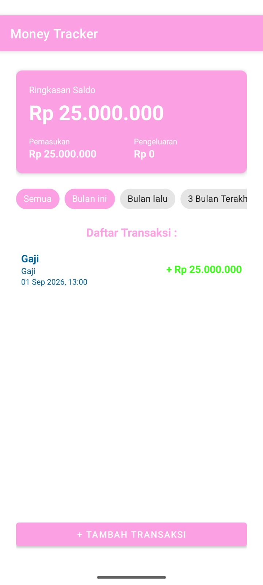
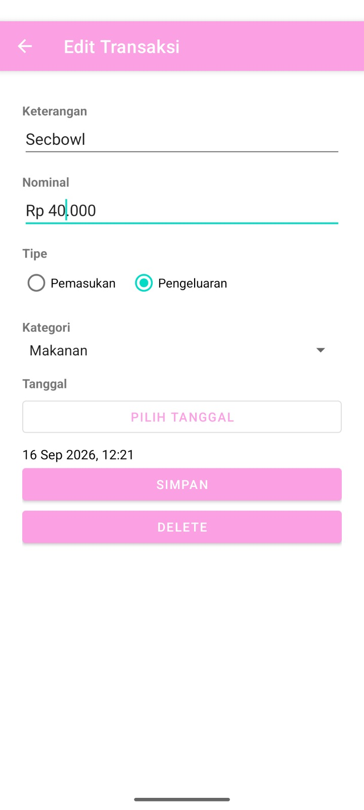
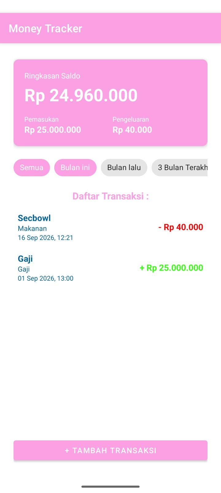

# Money Tracker

Money Tracker adalah aplikasi Android sederhana untuk mencatat pemasukan dan pengeluaran harian. Aplikasi ini dibangun dengan **Kotlin** dan menyimpan data secara lokal menggunakan **Room Database**, sehingga catatan keuangan tetap tersimpan di perangkat tanpa perlu koneksi internet.

Dengan Money Tracker, kita bisa:
- Melihat ringkasan saldo, total pemasukan, dan total pengeluaran secara real-time
- Menambahkan transaksi baru (pemasukan/pengeluaran) lengkap dengan kategori dan tanggal
- Mengedit atau menghapus transaksi yang sudah dicatat
- Memfilter daftar transaksi berdasarkan periode waktu (Semua, Bulan ini, Bulan lalu, 3 Bulan Terakhir)

## Tech Stack

- **Bahasa:** Kotlin
- **Database:** Room (SQLite)
- **Min SDK:** 24 (Android 7.0)
- **Target SDK:** 36
- **Build tool:** Gradle (Kotlin DSL)

## Kategori Transaksi

Aplikasi ini memiliki beberapa kategori bawaan:
`Makanan`, `Minuman`, `Transportasi`, `Kebutuhan`, `Gaji`

## Cara Penggunaan

Berikut alur penggunaan aplikasi Money Tracker dari awal:

### 1. Halaman Utama (Home)

Saat pertama kali dibuka, halaman utama menampilkan **Ringkasan Saldo** (masih `Rp 0` karena belum ada transaksi), filter periode (`Semua`, `Bulan ini`, `Bulan lalu`, `3 Bulan Terakhir`), daftar transaksi yang masih kosong, dan tombol **+ Tambah Transaksi** di bagian bawah.



### 2. Menambah Transaksi Baru

Tekan tombol **+ Tambah Transaksi** untuk membuka form **Tambah Transaksi**. Isi data berikut:
- **Keterangan** — nama/catatan transaksi (misal: `Gaji`)
- **Nominal** — jumlah uang (misal: `25000000`)
- **Tipe** — pilih `Pemasukan` atau `Pengeluaran`
- **Kategori** — pilih dari daftar kategori yang tersedia
- **Tanggal** — tekan **Pilih Tanggal** untuk menentukan tanggal & waktu transaksi

Setelah semua terisi, tekan **SIMPAN**.



### 3. Transaksi Tersimpan

Setelah disimpan, kita akan diarahkan kembali ke halaman utama. Ringkasan saldo langsung ter-update, dan transaksi baru muncul di **Daftar Transaksi**. Pada contoh ini, saldo bertambah menjadi `Rp 25.000.000` dari transaksi "Gaji".



### 4. Menambah Transaksi Pengeluaran

Kita bisa menambahkan transaksi lain dengan tipe `Pengeluaran` melalui langkah yang sama (tombol **+ Tambah Transaksi**). Setiap transaksi pengeluaran akan mengurangi saldo dan ditampilkan dengan warna merah beserta tanda minus (`-`), sedangkan pemasukan ditampilkan dengan warna hijau (`+`).


### 5. Mengedit Transaksi

Ketuk salah satu transaksi pada daftar untuk membuka halaman **Edit Transaksi**. Di sini kita bisa mengubah keterangan, nominal, tipe, kategori, maupun tanggal transaksi. Tersedia juga tombol:
- **SIMPAN** — menyimpan perubahan
- **DELETE** — menghapus transaksi



### 6. Perubahan Tersimpan

Setelah menekan **SIMPAN**, halaman utama akan menampilkan data yang sudah diperbarui. Pada contoh ini, nominal pengeluaran "Secbowl" diubah dari `Rp 45.000` menjadi `Rp 40.000`, sehingga saldo ikut ter-update menjadi `Rp 24.960.000`.



### 7. Menghapus Transaksi

Jika transaksi dihapus lewat tombol **DELETE** pada halaman edit, transaksi tersebut akan hilang dari daftar dan saldo otomatis dihitung ulang. Pada contoh ini, setelah transaksi "Secbowl" dihapus, saldo kembali menjadi `Rp 25.000.000` sesuai transaksi "Gaji" yang tersisa.


## Instalasi & Menjalankan Project

1. Clone repository ini
   ```bash
   git clone https://github.com/athayea/money-tracker.git
   ```
2. Buka project menggunakan **Android Studio**
3. Tunggu proses Gradle sync selesai
4. Jalankan aplikasi di emulator atau perangkat Android (`minSdk 24` ke atas) dengan menekan tombol **Run**

## Struktur Project Singkat

```
money-tracker/
├── app/src/main/java/com/example/moneytracker/
│   ├── MainActivity.kt              # Halaman utama (ringkasan saldo & daftar transaksi)
│   ├── AddTransactionActivity.kt    # Form tambah/edit transaksi
│   ├── Transaction.kt               # Model data transaksi (Room Entity)
│   ├── TransactionDao.kt            # Query database transaksi
│   ├── AppDatabase.kt               # Konfigurasi Room Database
│   ├── TransactionAdapter.kt        # Adapter RecyclerView daftar transaksi
│   ├── Rupiah.kt                    # Utility format mata uang Rupiah
│   └── TanggalUtility.kt            # Utility format tanggal
├── assets/                          # Screenshot aplikasi (untuk dokumentasi)
└── README.md
```

## Lisensi

Belum ditentukan.
